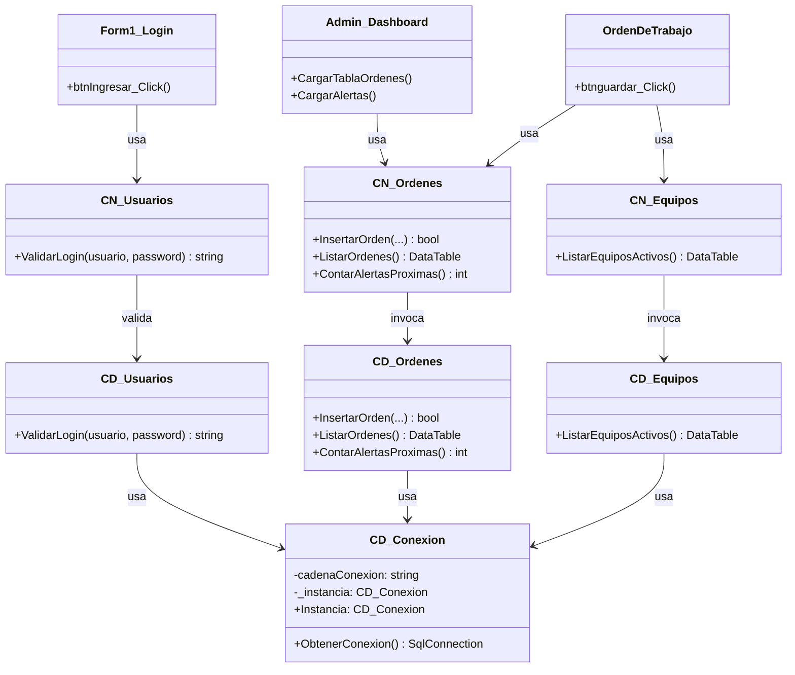
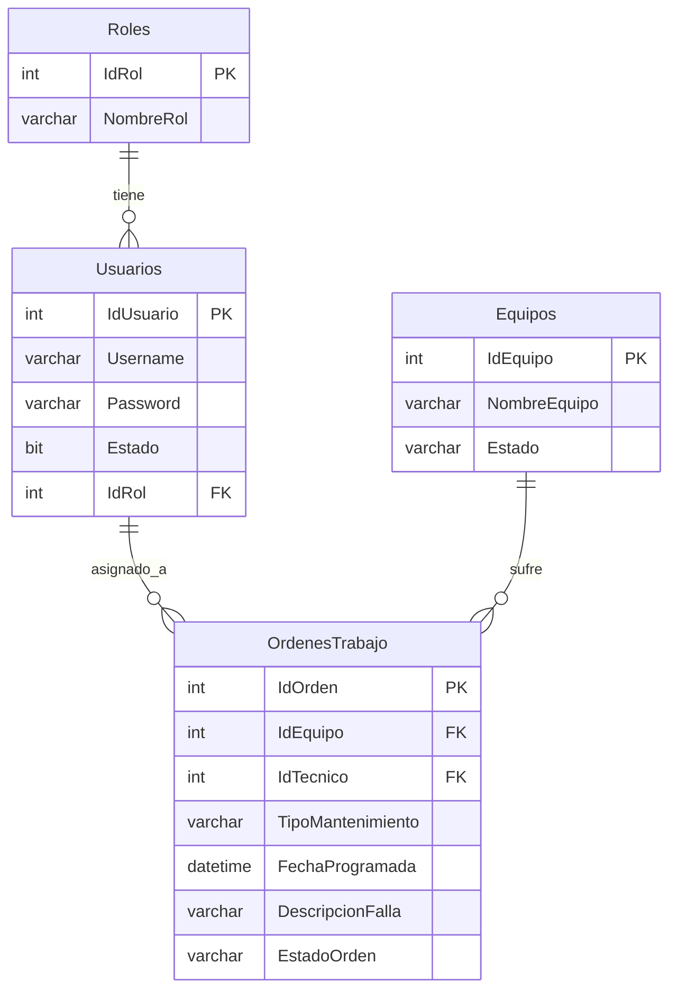

# Documentación Sprint 1 - Sistema de Mantenimiento

Este documento consolida los entregables requeridos para el **Sprint 1** del proyecto de Herramientas de Programación II.

---

## a) Definición del problema empresarial

**Contexto:** La empresa manufacturera "Industrias Técnicas S.A." depende en gran medida del correcto funcionamiento de su maquinaria de producción (motores eléctricos, bandas transportadoras, tornos, etc.). 
**Problema:** Actualmente, el registro y control de los mantenimientos de los equipos se lleva a cabo mediante hojas de cálculo en Excel y papeles impresos. Esto ocasiona:
1. Pérdida de información histórica sobre las fallas de los equipos.
2. Imposibilidad de generar alertas tempranas para mantenimientos preventivos.
3. Descoordinación entre los supervisores y los técnicos.
**Solución:** Se requiere desarrollar un "Sistema de Mantenimiento Preventivo y Correctivo" que digitalice y centralice el proceso de creación y seguimiento de órdenes de trabajo, permitiendo a diferentes roles interactuar con la plataforma de acuerdo a sus permisos.

---

## b) Levantamiento y redacción de requisitos funcionales y no funcionales

### Requisitos Funcionales (RF)
*   **RF01 - Autenticación:** El sistema debe permitir a los usuarios iniciar sesión mediante un nombre de usuario y contraseña.
*   **RF02 - Control de Roles:** El sistema debe restringir las funcionalidades dependiendo de si el usuario es Administrador, Técnico o Supervisor.
*   **RF03 - Dashboard Principal:** El sistema debe mostrar un listado general con todas las órdenes de trabajo activas y su estado actual.
*   **RF04 - Filtrado de Órdenes:** El sistema debe permitir filtrar las órdenes en el Dashboard por su estado (Pendiente, Completada) o tipo (Preventivo, Correctivo).
*   **RF05 - Creación de Órdenes:** El sistema debe permitir a los Técnicos y Administradores crear nuevas órdenes seleccionando el equipo, fecha, tipo de mantenimiento y la descripción de la falla.
*   **RF06 - Alertas Visuales:** El sistema debe alertar en el Dashboard cuántos mantenimientos están programados para los próximos 7 días.

### Requisitos No Funcionales (RNF)
*   **RNF01 - Arquitectura:** El sistema debe estar construido utilizando el patrón de Arquitectura de 3 Capas (Presentación, Negocio, Datos).
*   **RNF02 - Patrones de Diseño:** La conexión a la base de datos debe implementar el Patrón Singleton.
*   **RNF03 - Seguridad:** El sistema no debe contener consultas SQL embebidas en el código fuente, debe utilizar Procedimientos Almacenados (Stored Procedures) para prevenir inyección SQL.

---

## c) Identificación y documentación de reglas de negocio

*   **RN01 - Restricción de Fechas:** No se puede programar una orden de mantenimiento preventivo para una fecha que ya haya pasado (menor al día actual).
*   **RN02 - Obligatoriedad de Campos:** Al crear una orden, es estrictamente obligatorio seleccionar un equipo y proveer una descripción textual de la falla.
*   **RN03 - Permisos de Supervisor:** Un usuario con el rol de "Supervisor" no tiene permisos para crear nuevas órdenes de mantenimiento, solo puede monitorearlas.
*   **RN04 - Permisos de Técnico:** Un usuario con el rol de "Técnico" no tiene acceso al panel de gestión de equipos ni a la generación de reportes gerenciales.
*   **RN05 - Estado de Equipos:** Solo se pueden registrar órdenes de mantenimiento sobre equipos cuyo estado en el sistema sea "Activo".

---

## d) Diseño preliminar de arquitectura en capas

El proyecto adopta un diseño **N-Tier Architecture (3 Capas)** aplicando los principios SOLID (específicamente SRP - Principio de Responsabilidad Única):

1.  **Capa de Presentación (UI):** Formularios en Windows Forms. Su única responsabilidad es capturar la interacción del usuario y mostrar datos. No tienen comunicación directa con SQL.
2.  **Capa de Negocio (BLL):** Clases intermedias (`CN_Usuarios`, `CN_Ordenes`, `CN_Equipos`). Reciben las peticiones de la UI, ejecutan validaciones condicionales (Reglas de Negocio) y si todo es correcto, llaman a la Capa de Datos.
3.  **Capa de Datos (DAL):** Clases (`CD_Conexion`, `CD_Usuarios`, `CD_Ordenes`). Su única responsabilidad es abrir la conexión SQL (usando Patrón Singleton) y ejecutar los Procedimientos Almacenados.

---

## e) Diagrama de clases preliminar

---

## f) Modelo entidad-relación

