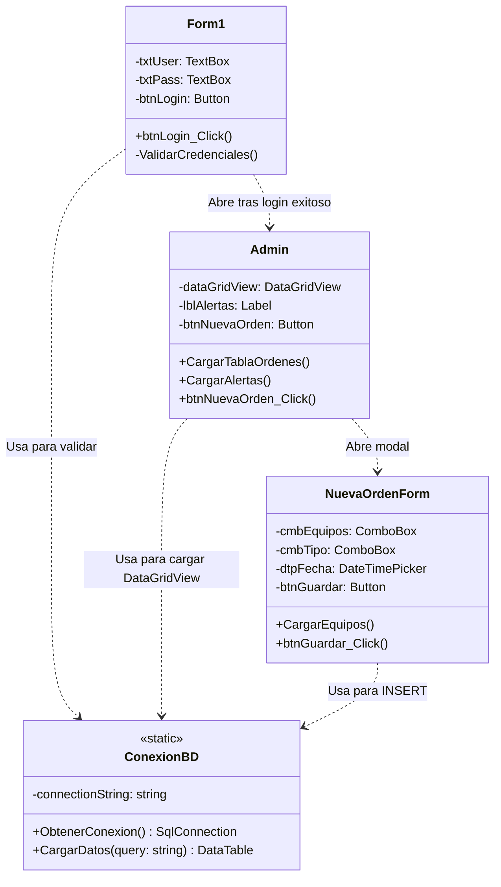
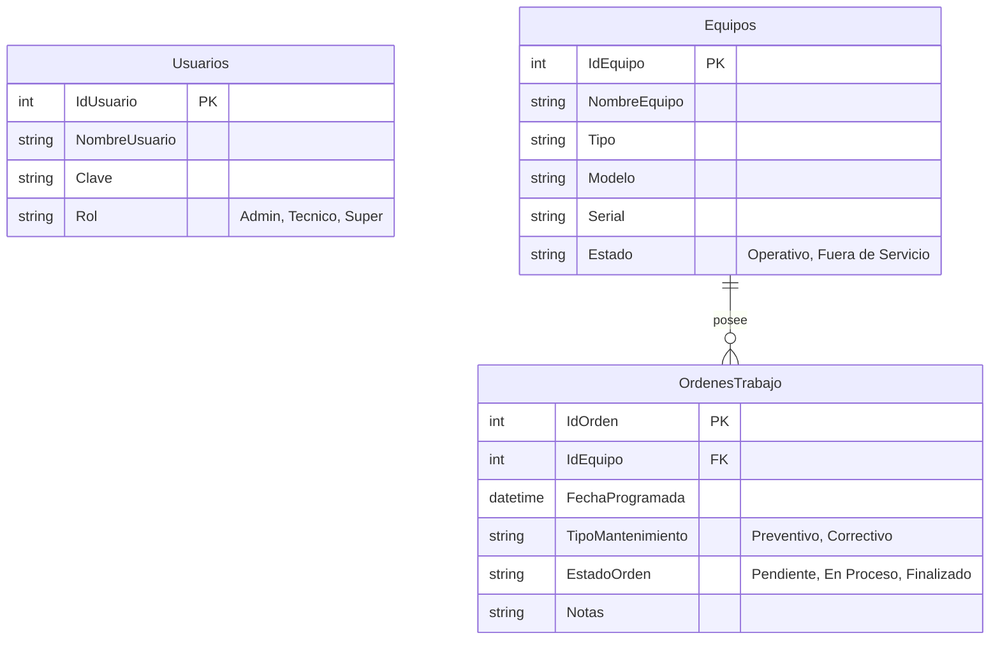

# Documentación Sprint 1 - Sistema de Mantenimiento

## a) Definición del problema empresarial

En muchas empresas industriales y tecnológicas, el control del mantenimiento de los equipos e infraestructuras se realiza de manera manual, desorganizada o a través de planillas genéricas. Esto genera pérdida de trazabilidad sobre qué técnico intervino un equipo, cuándo se deben realizar mantenimientos preventivos y qué historial de fallas (correctivos) posee cada máquina. Esta falta de gestión centralizada provoca paradas de producción inesperadas, pérdida de tiempo y un aumento en los costos operativos. Se necesita un sistema unificado que permita agendar, controlar y visualizar el estado de las órdenes de trabajo y del equipamiento.

---

## b) Levantamiento de Requisitos

### Requisitos Funcionales
1. **Gestión de Autenticación:** El sistema debe permitir el inicio de sesión a través de un nombre de usuario y una contraseña.
2. **Control de Roles:** El sistema debe distinguir entre tres niveles de acceso: `Admin` (control total), `Tecnico` (acceso a sus asignaciones) y `Super` (supervisión general).
3. **Gestión de Órdenes de Trabajo:** El sistema debe permitir crear, visualizar y actualizar el estado de las órdenes de trabajo.
4. **Visualización de Alertas:** El sistema debe mostrar un conteo rápido de los mantenimientos programados en la pantalla principal del administrador.
5. **Registro de Equipos:** Las órdenes de trabajo deben estar vinculadas a un equipo específico registrado en la base de datos.

### Requisitos No Funcionales
1. **Plataforma:** La interfaz de usuario debe estar desarrollada en tecnología de escritorio Windows Forms usando C#.
2. **Base de Datos:** El sistema debe persistir los datos en Microsoft SQL Server (LocalDB para desarrollo).
3. **Arquitectura:** El diseño debe orientarse a separar la lógica de acceso a datos de la interfaz de usuario.
4. **Usabilidad:** La interfaz debe ser intuitiva, con navegación clara entre formularios y uso de modales para el ingreso de datos.

---

## c) Reglas de Negocio

1. **Creación de Órdenes:** Únicamente los usuarios con rol `Admin` tienen permisos para crear nuevas órdenes de trabajo en el sistema.
2. **Visibilidad Técnica:** Un usuario con rol `Tecnico` solo debe poder visualizar y gestionar las órdenes que le han sido asignadas (futura implementación de filtrado por ID).
3. **Estados de Orden:** Toda nueva orden de trabajo debe inicializarse con el estado "Programado" o "Pendiente". No puede nacer como "Completado".
4. **Tipos de Mantenimiento:** El sistema solo maneja dos tipos exclusivos de mantenimiento: "Preventivo" y "Correctivo".

---

## d) Diseño preliminar de arquitectura en capas

El sistema adopta una **Arquitectura en Capas** simplificada (Two-Tier o Three-Tier conceptual) orientada a la mantenibilidad y escalabilidad del MVP:

1. **Capa de Presentación (Frontend):** 
   - Construida con Windows Forms (`Form1.cs`, `Admin.cs`, `NuevaOrdenForm.cs`). 
   - Se encarga exclusivamente de capturar la interacción del usuario y mostrar datos.
2. **Capa de Acceso a Datos (DAL):**
   - Centralizada en la clase estática/experta `ConexionBD.cs`.
   - Única responsable de abrir la conexión con SQL Server, ejecutar comandos (ExecuteReader, ExecuteNonQuery) y retornar `DataTable` desconectados para no acoplar la base de datos a la interfaz visual.

*(En futuros Sprints, se planea introducir explícitamente una Capa Lógica (BLL) intermedia para validar reglas de negocio antes de acceder a la BD).*

---

## e) Diagrama de Clases Preliminar

A continuación, se presenta la estructura orientada a objetos de la solución:

---

## f) Modelo Entidad-Relación (ER)

Diseño de la base de datos normalizada para soportar las entidades del negocio:

*(Fin de documentación teórica del Sprint 1)*
